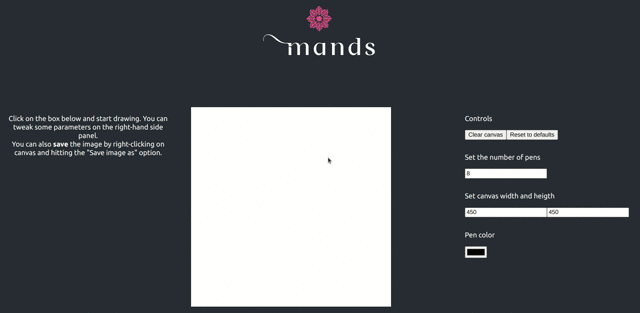

<p align="center"></p>

# mands

> The mandala maker for mandala lovers.



## Usage

```bash
# Clone the project and enter it
git clone https://github.com/lparolari/mands.git
cd mands

# Start the web service with yarn
yarn start
# or, with docker
docker-compose up web
```

## About

I started this project after having read the title of this [video](https://youtu.be/-vPh1548OHM) from Christopher Okhravi on YouTube. The idea seemed very interesting to me so I started the project. 

I'm going to write an article on the differences between mine and his solution, so stay tuned.

## Docs

The business logic is implemented in the [Mandala](src/Mandala.tsx) component, while the drawing logic is contained in the [Canvas](src/Canvas.tsx) component. 

However, the logics behind the mandala maker, which mirrors points along different axis on the plane, is outsourced to another package, [axisly](https://github.com/lparolari/axisly). Feel free to take a look at it.

## Related projects

- [Axisly](https://github.com/lparolari/axisly), rotate points along a 2d surface.

## Author

* [Luca Parolari](https://github.com/lparolari)

## Credits
* [Christopher Okhravi](https://www.youtube.com/channel/UCbF-4yQQAWw-UnuCd2Azfzg), for inspiring me
* [All contributors](https://github.com/lparolari/mands/contributors)

## License

This project is MIT licensed. See [LICENSE](LICENSE) file.